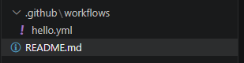
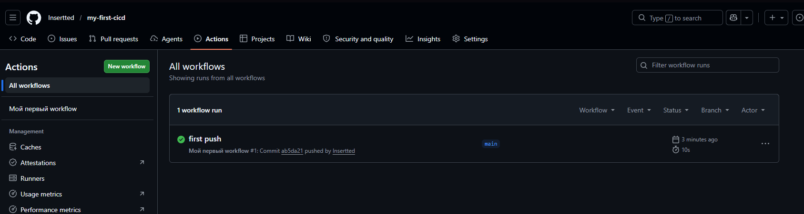

# my-first-cicd

Это первый workflow через github actions

Цель - Познакомится с системой action в гитхабе и получить базовые знания про пайплайны


Сначала была создана структура проекта


Затем закопипасчен простой код в hello.yml
```bash
name: Мой первый workflow
on: [push] # Запускать при каждом пуше
jobs:
  build:
    runs-on: ubuntu-latest # Использовать последнюю версию Ubuntu
    steps:
      - uses: actions/checkout@v4 # Шаг 1: скачать код из репозитория
      - name: Запустить команду
        run: echo "Привет, мир! Я только что запустил CI!"
```

После пуша зашел на страницу github actions
Все тесты прошли успешно

